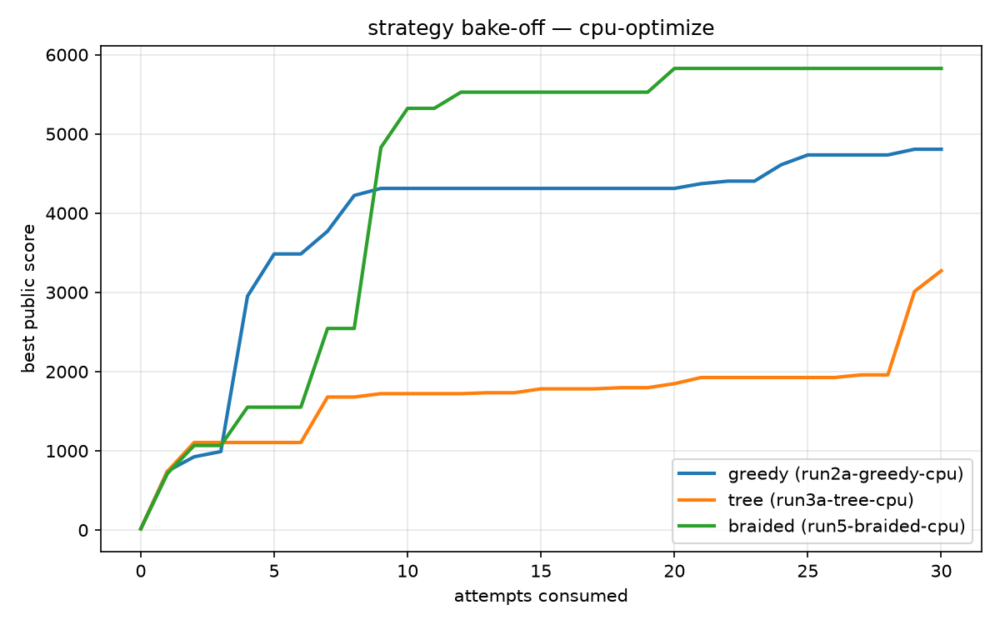
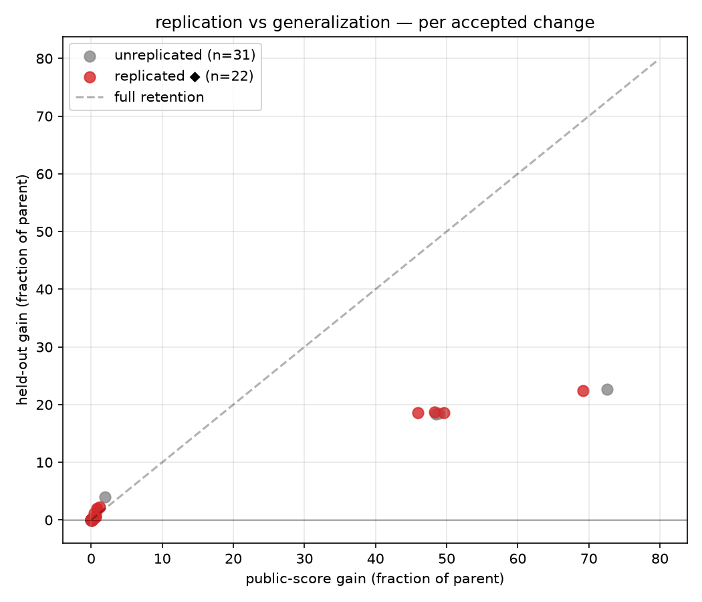

# Braided Autoresearch — Final Report

Three search strategies over the same task, same attempt budget, same noise-calibrated acceptance rule. Greedy = single-lineage keep-or-revert (the Karpathy-style control). Tree = UCB1 over multiple lineages. Braided = tree + agent-mediated semantic merges + cross-lineage replication tagging.

## 1. Bake-off

```
run                          strategy attempts   baseline       best   gain %
-----------------------------------------------------------------------------
run2a-greedy-cpu             greedy         30    15.0380  4806.4990 +31862.4
run3a-tree-cpu               tree           30    15.0243  3272.1980 +21679.3
run5-braided-cpu             braided        30    15.2053  5826.5440 +38219.1
```



## 2. Replication vs generalization

Claim under test: improvements that replicate across independent lineages retain more of their public gain on the private held-out scorer.

- accepted changes analyzed: **53**
- replicated: n=22, mean held-out retention 1.005
- unreplicated: n=31, mean held-out retention 1.459
- effect (replicated − unreplicated): **-0.453**

**Hypothesis not supported on this task — and the likely reason is instructive**: both groups retained essentially all of their gain on the held-out scorer (retention ≥ 1), i.e. no reward hacking occurred for the detector to catch. This task's public scorer has a byte-exact correctness oracle, which blocks metric-gaming by construction. The replication signal is designed for tasks with softer scorers (e.g. validation loss), where public gains CAN be fake; a GPU nanogpt series is the right follow-up test.

This is a directional finding at hackathon sample size, not a significance claim.



## 3. Interaction map (which change-classes stack)

| class pair | compose | interfere |
|---|---|---|
| char-loop-to-regex-scan × linear-scan-to-dict | 0 | 1 |
| char-loop-to-regex-scan × list-build-to-fused-slice-join | 0 | 2 |
| chunking-strategy-interleave × linear-scan-to-dict | 1 | 1 |
| chunking-strategy-interleave × linear-scan-to-heap-topk | 1 | 0 |
| chunking-strategy-interleave × linear-scan-to-set | 1 | 0 |
| chunking-strategy-interleave × list-build-to-fused-slice-join | 0 | 1 |
| finer-chunks-imap-unordered × linear-scan-to-dict | 1 | 0 |
| finer-chunks-imap-unordered × linear-scan-to-heap-topk | 1 | 0 |
| finer-chunks-imap-unordered × linear-scan-to-set | 1 | 0 |
| linear-scan-to-dict × linear-scan-to-dict | 1 | 0 |
| linear-scan-to-dict × linear-scan-to-heap-topk | 1 | 0 |
| linear-scan-to-dict × linear-scan-to-set | 1 | 0 |
| linear-scan-to-dict × list-build-to-fused-slice-join | 0 | 1 |
| list-build-to-fused-slice-join × list-build-to-fused-slice-join | 0 | 2 |

## 4. Final DAGs

### run2a-greedy-cpu
```
* ad0eeac6 [4806.4990] (main) For n==2 (the benchmarked default), zip(tokens, *(
* 6926fa7e [4734.6990] (main) count_ngrams currently materializes two separate O
* 5df4e9db [4610.6140] (main) count_ngrams currently runs the counting increment
* 6ed76a46 [4404.0250] (main) count_ngrams currently builds an explicit `slices`
* 3aaf9bcc [4371.8710] (main) count_ngrams currently rebinds the loop variable g
* 80e71b56 [4312.2500] (main) count_ngrams currently builds the tuple-of-slices
* 54fc5535 [4223.0620] (main) count_ngrams currently rebuilds a fresh length-n l
* c8634a2f [3771.9240] (main) tokenize() currently uses re.finditer plus match.g
* 83af800a [3484.8870] (main) count_ngrams currently makes a full pass building
* 6c23491c [2952.2550] (main) top_ngrams currently does k rounds of an O(m) pure
* 25fed809 [990.5560] (main) tokenize() currently builds each token via per-cha
* 49172041 [924.7520] (main) Membership tests `token not in STOPWORDS` run twic
* 66b17576 [744.4440] (main) Replace the O(n) linear-scan `keys.index(gram)` lo
* 37c6bd6e [15.0380] (main) baseline
```

### run3a-tree-cpu
```
* 524f2562 ◆ [3272.1980] (b1) count_ngrams(n==2) currently calls tokenize() to m
* 6d3d3006 ◆ [3012.1540] (b1) top_ngrams currently sorts the entire unique-ngram
* d421df28 ◆ [1907.1990] (b1) The n==2 loop currently computes len(tokens), incr
* e9205d0a ◆ [1904.8440] (b1) For the common bigram case (n==2), " ".join(tokens
* 80009a85 [1819.8440] (b1) The counting update currently does an 'in' members
* eaa7b543 [1796.9610] (b1) count_ngrams currently builds a full intermediate
* 782f21c5 ◆ [1721.3160] (b1) ngrams_of builds each gram with a nested Python lo
* b50a541d [1678.8900] (b1) top_ngrams currently does a selection-sort over th
* c362931a [925.3270] (b1) tokenize() checks `token not in STOPWORDS` twice p
* 1cf7892b ◆ [741.1500] (b1) count_ngrams does a linear `keys.index(gram)` scan
| * 28fef066 [1958.3140] (main) Per-character classification currently pays two po
| * c8a59a87 ◆ [1925.2210] (main) In the n==2 hot loop, tokens[i] and tokens[i+1] ar
| * 222e6245 ◆ [1847.5750] (main) For each n-gram window, tokens[i:i+n] allocates a
| * 884b18bf ◆ [1782.3010] (main) count_ngrams currently builds a full intermediate
| * d836aadf ◆ [1732.9820] (main) top_ngrams currently does k full O(n) linear scans
| * acac0457 ◆ [935.1050] (main) tokenize() checks `token not in STOPWORDS` against
| * eda17a60 ◆ [761.4800] (main) ngrams_of rebuilds each gram with a nested Python
| * f5960cc0 [749.5740] (main) count_ngrams uses keys.index(gram), which linearly
|/  
| * 1980748d ◆ [1107.7950] (b2) Inside the already-parallel _count_chunk worker, n
| * d011f739 [1105.1770] (b2) Shard documents across a persistent ProcessPoolExe
|/  
* 0f77190e [15.0243] (main) baseline
```

### run5-braided-cpu
```
* 9d7c0b18 [1654.1370] (main) Interning each token via sys.intern as it's append
* 1c27f084 [1530.0420] (main) ngrams_of currently wraps zip(*slices) in list(...
* 2dc94a23 [1518.3760] (main) ngrams_of builds the shifted-slice generator token
* 659e199c [1514.7590] (main) ngrams_of currently builds each n-gram by slicing
* 3eb456ab ◆ [1436.9330] (main) top_ngrams currently does a k-times full linear sc
* 5a981498 ◆ [981.2720] (main) STOPWORDS is a plain list, so `token not in STOPWO
* a9b6781e [773.5620] (main) Building each n-gram as a freshly-concatenated str
* 72bca534 ◆ [769.7850] (main) count_ngrams currently does `if gram in keys: idx
| * 60b7cba0 [2902.2940] (b1) Each repeated n-gram currently costs 3 dict hash l
| * 40b82af2 [2901.0730] (b1) count_ngrams currently makes three full O(m) passe
| * 18a3044d ◆ [2892.9600] (b1) count_ngrams currently builds every n-gram via ngr
| | * f008c9b9 [5826.5440] (m0) num_chunks = workers*4 forces 4x more IPC round-tr
| | * aceaa8f2 ◆ [5526.9740] (m0) The per-chunk counting loop does two Python-level
| | * 957e03d8 [5322.7350] (m0) tokenize() runs a pure-Python per-character loop (
| | * 47e4b999 [4828.4500] (m0) Both lineages independently fix the same O(n^2) ho
| |/| 
| | * 3e00b718 [1085.0150] (b2) Contiguous slicing (docs[i:i+chunk_size]) means an
| | * 7f75b622 [1076.1280] (b2) Splitting docs into exactly `workers` chunks means
| | * 09615914 ◆ [1067.1310] (b2) count_ngrams is pure-Python CPU work serialized by
| |/  
|/|   
| * 05e06ed3 ◆ [2544.4160] (b1) STOPWORDS is a plain list, so `token not in STOPWO
| * d28f71b4 ◆ [1550.8540] (b1) top_ngrams currently does a full selection sort ov
| * 1742a57f ◆ [713.4090] (b1) count_ngrams uses `if gram in keys: idx = keys.ind
|/  
* 40bbe619 [15.2053] (main) baseline
```

## 5. Limitations

- **Noise floor**: acceptance threshold is 1.5× baseline std measured at init; scorer variance drifts with machine load, so some accepts/rejects near the threshold are coin flips.
- **Lineage independence is approximate**: direction hints diversify lineages but all share one proposer model and see sibling digests; replication is evidence, not proof, of independent rediscovery.
- **One task family** per series; findings may not transfer.
- **LLM classifier subjectivity**: change-class labels are model judgments; the replication verifier is only as good as the label granularity.
- **Attempt budget ≠ token budget**: merge attempts cost one attempt but larger prompts; strategies are equalized on scorer executions.

## 6. Future work

- **Extrapolator**: the replication tags provide exactly the trigger a step-size controller needs. When a change-class is accepted ≥2× on a lineage (or replicates across lineages), switch that branch's proposer from "one focused change" to "push this mechanism to its endpoint in a single larger patch". Deliberately excluded from this bake-off to keep the proposer identical across strategies.
- **Sandbox hardening**: swap subprocess isolation for E2B/Modal.
- **Second task family**: the nanogpt-shakespeare adapter is ready; a GPU series would test transfer of the replication finding.